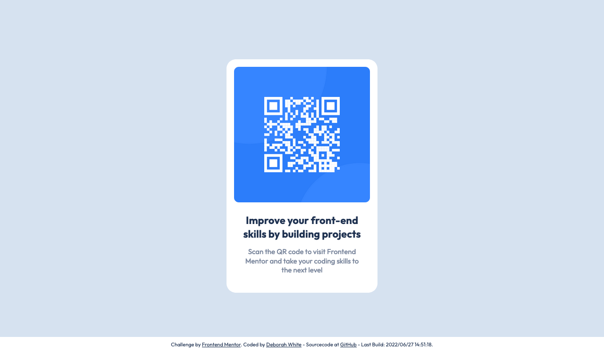

# Frontend Mentor - QR code component solution

)
)

This is a solution to the [QR code component challenge on Frontend Mentor](https://www.frontendmentor.io/challenges/qr-code-component-iux_sIO_H). Frontend Mentor challenges help you improve your coding skills by building realistic projects.

## Table of contents

- [Overview](#overview)
  - [Screenshot](#screenshot)
  - [Links](#links)
- [My process](#my-process)
  - [Built with](#built-with)
  - [What I learned](#what-i-learned)
  - [Continued development](#continued-development)
  - [Useful resources](#useful-resources)
- [Author](#author)

## Overview

### Screenshot

### Links

- Solution URL: [Source code on GitHub](https://github.com/gelbehexe/frontend-mentor-qr-code-component)
- Live Site URL: [My live page on a server](https://fm-qr-code-gelbehexe.netlify.app/)

## My process

### Built with

- Semantic HTML5 markup
- CSS custom properties
- CSS Grid
- Mobile-first workflow
- [Sass](https://sass-lang.com/) - Sass stylesheet language
- [JavaScript](https://developer.mozilla.org/en-US/docs/Web/JavaScript/Reference) - JavasScript language
- [webpack](https://webpack.js.org/) - Static module bundler
- [HtmlWebpackPlugin](https://github.com/jantimon/html-webpack-plugin/blob/main/README.md) - HTML file creator (webpack plugin)
- [postcss](https://postcss.org/) - CSS transformer with JavScript
- [eslint](https://eslint.org/) - Static code analyzer
- [stylelint](https://stylelint.io/) - Static code analyzer for css/scss
- [prettier](https://prettier.io/) - An opinionated code formatter
- [babel](https://babeljs.io/) - JavaScript compiler

### What I learned

I learned to finish a project quick and easy in less than 30 minutes. Maybe it may a bit overwhelmed
to use webpack for such a small project, but I just copied and pasted from a previously solved channel.

This project may be too easy in relation to my skills. But I accidentally started it and did not want to have
an unfinished project on my dashboard. 

### Continued development

I think for now it's done.

### Useful resources

See [Build with](#built-with)

## Author

- Frontend Mentor - [@gelbehexe](https://www.frontendmentor.io/profile/gelbehexe)
